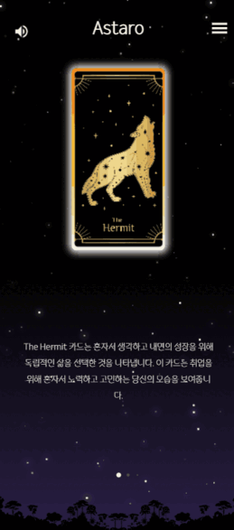

# 🌠 Astaro - 고민을 들어주는 타로상담 서비스

### [☆ Astaro 소개영상](https://youtu.be/6wQdfKWgYaI)

<br />

## ⏳ 프로젝트 요약

2학기 자율프로젝트
<br />
개발기간: 2023.04.10 ~ 2023.05.18 (6주)
<br />
<br />
member-service: 권영진(PM),류제엽
<br />
taro-service: 박균탁, 박성민
<br />
board-service: 김정민, 손승환

</br>
</br>

### 기술 스택


<br/>


<br/>


<br />


<br/>


<br/>
<br/>

## 🎬 배경

_-누구나 고민을 안고 살아가지 않나요?-_
현대인과 고민은 떨어질 수 없는 사이입니다. 그리고 그 고민을 풀어내는 방법도 여러가지죠.
<br />
그 고민을 타로로 풀면 어떨까요? 때로는 가볍게, 때로는 진지하게, 고민을 풀 곳이 있으면 하는 마음에서 출발했습니다.
<br />
<br />

## 🔍 개요

_-고민을 들어드리고 덜어드립니다-_
<br /><br />
Astaro는 별(astro-)와 타로(tarot)의 합성어입니다. 우주의 빛나는 별과 같은 존재인 당신의 말못할 고민을 들어주고자 합니다.
<br /><br />
Astaro는 AI를 이용한 온라인 타로점 서비스입니다. 웹으로 구성된 비대면 타로서비스를 통해 개인화된 결과를 제공합니다. AI가 결과를 분석하여 그에 맞는 이미지와 스토리를 맞춤형으로 보여주어, 기존의 온라인과 오프라인 타로점의 간극을 채우고자 하였습니다.
</br>
</br>

## ⭐ 주요기능

---

<br />

### 타로카드 뽑기

- 고민 카테고리와 내용입력을 통해 카드를 뽑게 됩니다.
- 뽑은 카드의 의미를 고민에 맞추어 해석해줍니다.

  <br />

### AI를 이용한 스토리와 이미지 생성

- chatGPT API에서 뽑은 카드의 의미를 담아 스토리를 생성합니다.
- chatGPT API로 생성한 스토리에서 키워드를 추출하고, <br />
  DALL-E API에서 그에 맞는 이미지를 생성합니다.
- 생성된 이미지는 샌드아트형태의 영상으로 스토리와 함께 확인할 수 있습니다.

  <br />

### 별똥별

- 타로 결과를 다른 사람들과 공유할 수 있습니다.
- 다른 사람들이 공유한 결과를 랜덤하게 확인할 수 있습니다.
- 유사한 고민, 원하는 결과를 가진 다른 사람에게 메세지를 보낼 수 있습니다.
  <br />
  <br />

## 🛠 주요기술

---

**BackEnd**

- IntelliJ IDE
- Spring Boot 2.7.8
- Spring Cloud Eureka Server
- Spring Gateway
- Spring Data JPA
- Spring Security
- Swagger
- Flask
- OpenCV
- MySQL

**FrontEnd**

- Visual Studio Code IDE
- React 18.0
- Redux/toolkit
- Node.js 18.15.0
- Styled Component

**Design**

- Figma

**CI/CD**

- AWS EC2
- AWS S3
- MobaXterm
- NGINX

<br />

## 📔 프로젝트 파일구조

---

<details>
<summary>
Back
</summary>

```
backend
├─eureka-server
│  ├─gradle
│  └─src
│      ├─main
│      │  ├─java
│      │  │  └─com
│      │  │      └─a604
│      │  │          └─eurekaserver
│      │  └─resources
│      └─test
│
├─gateway-server
│  ├─gradle
│  └─src
│      ├─main
│      │  ├─java
│      │  │  └─com
│      │  │      └─a604
│      │  │          └─gatewayserver
│      │  │              ├─filter
│      │  │              └─util
│      │  └─resources
│      └─test
│
├─member-service
│  ├─gradle
│  └─src
│      ├─main
│      │  ├─java
│      │  │  └─com
│      │  │      └─a604
│      │  │          └─memberservice
│      │  │              ├─config
│      │  │              ├─controller
│      │  │              ├─dto
│      │  │              │  ├─request
│      │  │              │  └─response
│      │  │              ├─entity
│      │  │              ├─repository
│      │  │              ├─service
│      │  │              │  └─impl
│      │  │              └─util
│      │  └─resources
│      └─test
│
├─board-service
│  ├─gradle
│  └─src
│      ├─main
│      │  ├─java
│      │  │  └─com
│      │  │      └─a604
│      │  │          └─boardservice
│      │  │              ├─config
│      │  │              ├─controller
│      │  │              ├─dto
│      │  │              ├─entity
│      │  │              ├─repository
│      │  │              ├─service
│      │  │              └─util
│      │  └─resources
│      └─test
│
├─taro-service
│    ├─gradle
│    └─src
│       ├─main
│       │  ├─java
│       │  │  └─com
│       │  │      └─a604
│       │  │          └─taroservice
│       │  │              ├─config
│       │  │              ├─controller
│       │  │              ├─data
│       │  │              │  └─dto
│       │  │              ├─repository
│       │  │              └─service
│       │  └─resources
│       └─test
│
└─sandart-service


```

</details>

<details>

<summary>
Front
</summary>

```
frontend
├─node_modules
├─public
└─src
    ├─app
    ├─assets
    │  ├─font
    │  ├─img
    │  └─navigation
    ├─component
    │  ├─common
    │  ├─layout
    │  ├─message
    │  ├─shootingStar
    │  ├─tarot
    │  └─text
    ├─constants
    ├─css
    ├─features
    │  ├─commonSlice
    │  ├─messageSlice
    │  └─shootingStarSlice
    ├─page
    │  ├─member
    │  ├─message
    │  ├─shootingStar
    │  └─tarot
    └─utils

```

</details>

<br />

## 🔈 협업 툴

---

- Git
- Notion
- JIRA
- Mattermost

<br />

## 🎀 프로젝트 결과물

---

- [기능명세서]()
- [중간발표자료](./docs/자율_A604_중간발표.pptx)
- [최종발표자료](./docs/자율_A604_최종발표.pptx)

<br />

## 🌟 Astaro 서비스 화면

---

### 메인화면

- 주요기능을 확인할 수 있습니다.
  <br />
  <br />
  
  <br />

### 오늘의 운세

- 로그인없이 간단하게 운세를 볼 수 있습니다.
- 결과창 공유를 통해 화면 캡쳐와 url 공유가 가능합니다.
  <br/>
  <br/>
  
  <br/>

### 고민타로

- 카테고리를 선택하고 고민을 입력하세요.
  <br />
  <br />
  
  <br />
  <br />
- 카드를 선택하면 로딩을 거쳐 의미를 확인할 수 있습니다.
  <br />
  <br />
  
  
  <br />
- 스토리와 함께 이미지가 생성되는 과정을 영상으로 제공합니다.
  <br />
  <br />
  
  <br />
  <br />

### 별똥별

- 카테고리별로 쏟아지는 별을 통해 다른 사람의 스토리를 볼 수 있습니다.
- 스토리 확인 후 마음에 드는 결과를 보고 메세지를 보낼 수 있습니다.
  <br />
  <br />
  
  <br />
  <br />

### 채팅방

- 채팅목록에서 여러 사람과의 채팅 내역을 확인할 수 있습니다.
- 메세지는 F-word Filter를 통해 불건전한 문자를 걸러냅니다.
  <br />
  <br />
  
  
  <br />
  <br />

### 블랙홀

- 고민을 덜어내는 것만으로도 해소가 가능합니다.
- 고민을 속 시원하게 털어보세요.
  <br />
  <br />
  
  <br />
  <br />

## 시스템 구성


<br />

## ERD


<br />
